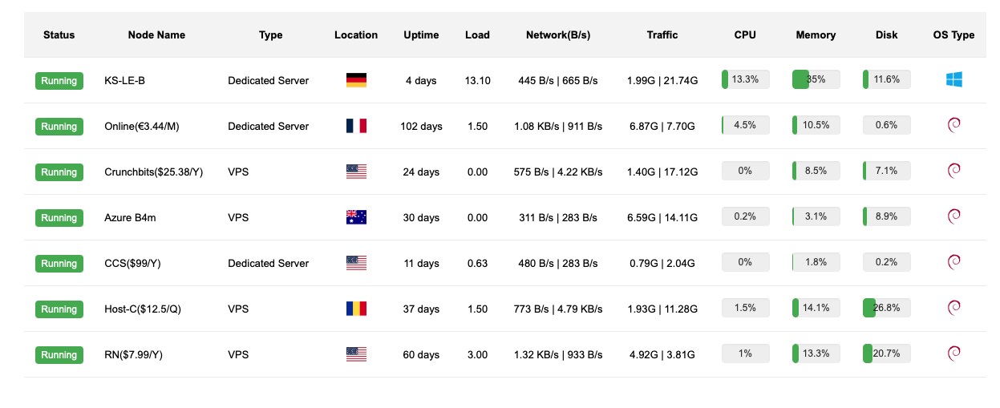
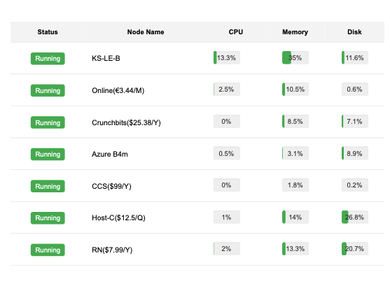

# Server Monitor

A lightweight server monitoring system that supports both Linux and Windows platforms, providing real-time monitoring of server status including CPU, memory, disk usage, and network traffic.

<div style="display: flex; justify-content: space-between; margin: 20px 0;">
    
    
</div>

## Features

- Real-time monitoring of multiple servers
- Support for both Linux and Windows systems
- Automatic server type detection (VPS/Dedicated)
- System resource monitoring (CPU, Memory, Disk)
- Network traffic monitoring
- Server location detection
- Responsive web interface
- Auto-reconnect mechanism
- Custom node naming

## Quick Installation

### Server Side

#### Linux:

```
bash <(curl -fsSL https://raw.githubusercontent.com/wanghui5801/Server_Monitor/main/install_server_linux.sh)
```


### Client Side

#### Linux:


```
bash <(curl -fsSL https://raw.githubusercontent.com/wanghui5801/Server_Monitor/main/install_client_linux.sh)
```


#### Windows:


```
curl -fsSL https://raw.githubusercontent.com/wanghui5801/Server_Monitor/main/install_client_windows.bat -o install.bat && install.bat
```


## Prerequisites

### Server Side:
- Python 3.6+
- Git
- pip

### Client Side:
- Python 3.6+
- Git
- pip
- Administrator/Root privileges
- For Windows: wmi and pywin32 packages (automatically installed by script)

## Manual Installation

1. Clone the repository:


```
git clone https://github.com/wanghui5801/Server_Monitor.git
```


2. Create virtual environment:


```
python3 -m venv venv
source venv/bin/activate  # Linux
venv\Scripts\activate     # Windows
```


3. Install dependencies:

```
pip install -r requirements.txt
```


4. Run the server:

```
python server/app.py
```


5. Run the client:

```
python client/monitor.py
```


## Configuration

- Server default port: 5000
- Client update interval: 5 seconds
- Client retry mechanism: 3 attempts with 30-second delay
- Server timeout: 10 seconds for inactive clients

## Web Interface

Access the monitoring dashboard at `http://your-server-ip:5000` after starting the server.

## License

MIT License

## Contributing

1. Fork the repository
2. Create your feature branch
3. Commit your changes
4. Push to the branch
5. Create a new Pull Request